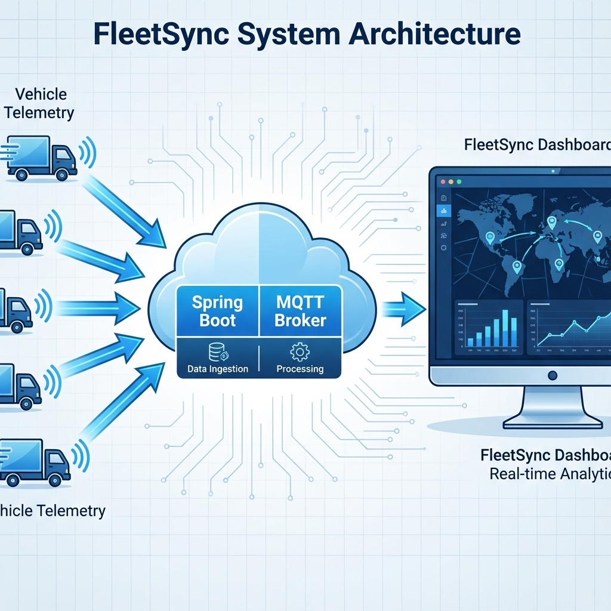
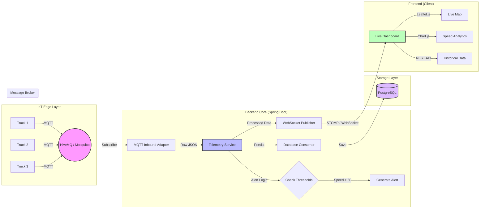

# FleetSync | Real-Time IoT Logistics Tracker 🚛 📡

**FleetSync** is an enterprise-grade, real-time logistics monitoring system demonstrating **Event-Driven Architecture** with **Apache Kafka** and **WebSockets**. Track moving assets (trucks) instantly using MQTT, Kafka streaming, and live dashboards.



## 🏗️ Architecture

The system implements a complete streaming pipeline:

```
Truck Simulator → MQTT → Spring Boot (Producer) → Kafka → Spring Boot (Consumer) → WebSocket → Dashboard
```



## 🚀 Features

*   **Real-Time Ingestion**: Consumes high-frequency telemetry via **MQTT**
*   **Kafka Streaming**: Decoupled pipeline for scalability
*   **Persistent Storage**: **PostgreSQL** for historical data analysis
*   **Live Map Visualization**: Tracks vehicles on an interactive map using **Leaflet.js**
*   **Instant Updates**: Uses **WebSockets (STOMP)** for zero-latency updates
*   **Intelligent Alerting**: Flags **Speeding**, **Overheating**, **Low Fuel**
*   **REST APIs**: 11 endpoints for monitoring fleet, Kafka, system health, and history
*   **IoT Simulator**: Built-in simulator for realistic traffic patterns

## 🛠️ Tech Stack

*   **Backend**: Java 17, Spring Boot 3.2
*   **Messaging**: Apache Kafka, Spring Integration MQTT, Eclipse Paho
*   **Database**: PostgreSQL 15 (Docker)
*   **Real-Time**: Spring WebSocket (STOMP)
*   **Frontend**: Vanilla JavaScript, Leaflet.js (Maps), Chart.js (Analytics)
*   **Infrastructure**: Docker, Docker Compose
*   **Build Tool**: Maven

## 🏃‍♂️ Quick Start

### Prerequisites
- Java 17+
- Maven 3.6+
- Docker & Docker Compose

### 1. Clone the Repository
```bash
git clone https://github.com/iam-ssrivastav/fleetsync-realtime-logistics.git
cd fleetsync-realtime-logistics
```

### 2. Start Kafka Infrastructure
```bash
./start-kafka.sh
```

This will:
- Start Zookeeper (port 2181)
- Start Kafka (port 9093)
- Wait for Kafka to be ready

### 3. Run the Application
```bash
mvn spring-boot:run
```

### 4. Access the Dashboard
Open your browser to **http://localhost:8080**

You should see:
- ✅ Live map with 5 trucks moving in NYC
- ✅ Real-time table with telemetry data
- ✅ Average speed chart updating
- ✅ Alert feed for critical events

## 📡 REST APIs

FleetSync provides 8 REST endpoints for monitoring:

### Fleet APIs
```bash
# Get fleet statistics
curl http://localhost:8080/api/fleet/stats

# Get all truck telemetry
curl http://localhost:8080/api/fleet/trucks

# Get recent alerts
curl http://localhost:8080/api/fleet/alerts
```

### Kafka Metrics
```bash
# Check Kafka consumer status
curl http://localhost:8080/api/metrics/kafka/consumer

# List Kafka topics
curl http://localhost:8080/api/metrics/kafka/topics
```

### Health Checks
```bash
# Verify Kafka connectivity
curl http://localhost:8080/api/health/kafka

# Check overall system health
curl http://localhost:8080/api/health/system
```

### System Metrics
```bash
# Get JVM and memory stats
curl http://localhost:8080/api/metrics/realtime
```

**📦 Postman Collection**: Import `FleetSync_API_Collection.postman_collection.json` into Postman for easy testing. See [POSTMAN_GUIDE.md](POSTMAN_GUIDE.md) for details.

## 📚 Documentation

- **[API Documentation](API_DOCUMENTATION.md)** - Complete API reference with examples
- **[Postman Guide](POSTMAN_GUIDE.md)** - How to use the Postman collection
- **[Kafka Health Check](kafka_health_check.md)** - Kafka monitoring and troubleshooting
- **[Scaling with Kafka](scaling_with_kafka.md)** - Architecture deep dive
- **[Project Explanation](project_explanation.md)** - Technical overview for interviews

## 📚 Project Structure

```
src/main/java/com/fleetsync
├── config/          # MQTT & WebSocket & Kafka Configuration
├── controller/      # REST API Controllers (Health, Metrics, Fleet)
├── model/           # Data Models (TruckTelemetry)
├── service/         # Business Logic (Telemetry, Kafka Consumer)
└── simulator/       # IoT Device Simulator
```

## 🔧 Configuration

### Kafka Configuration
Edit `src/main/resources/application.properties`:
```properties
spring.kafka.bootstrap-servers=localhost:9093
spring.kafka.consumer.group-id=fleetsync-dashboard
```

### Change Kafka Port
If port 9093 is in use, update:
1. `docker-compose.yml` - Change port mapping
2. `application.properties` - Update `bootstrap-servers`

## 🐛 Troubleshooting

### Kafka Connection Failed
```bash
# Check if Kafka is running
docker ps | grep kafka

# Restart Kafka
docker-compose down
docker-compose up -d
```

### Port 8080 Already in Use
```bash
# Find and kill the process
lsof -ti:8080 | xargs kill -9
```

### No Trucks on Map
- Wait 5-10 seconds for data to flow through the pipeline
- Check browser console for WebSocket errors
- Verify Kafka health: `curl http://localhost:8080/api/health/kafka`

## 🧪 Verification

### 1. Check Kafka Consumer
```bash
curl http://localhost:8080/api/metrics/kafka/consumer
```
Expected: `"state": "Stable"`, `"members": 1`

### 2. Verify Data Flow
```bash
# Watch messages in Kafka
docker exec -it kafka kafka-console-consumer \
  --bootstrap-server localhost:9093 \
  --topic fleet-telemetry \
  --from-beginning \
  --max-messages 5
```

### 3. Monitor Fleet Stats
```bash
# Real-time monitoring
watch -n 2 'curl -s http://localhost:8080/api/fleet/stats | python3 -m json.tool'
```

## 🧪 Verification & Outputs

### 1. End-to-End Pipeline Verification


### 2. API Output Examples

**Fleet Stats (Real-Time):**
```json
{
    "activeTrucks": 5,
    "averageSpeed": 72.3,
    "averageEngineTemp": 85.4,
    "averageFuelLevel": 66.2
}
```

**Kafka Consumer Status:**
```json
{
    "groupId": "fleetsync-dashboard",
    "state": "Stable",
    "currentOffset": 1806,
    "members": 1
}
```

**Historical Data (PostgreSQL):**
```json
{
    "data": [
        {
            "truckId": "TRUCK-001",
            "speed": 65.3,
            "timestamp": 1764615599362
        }
    ],
    "count": 100
}
```

### 3. Database Verification
```sql
fleetsync=# SELECT COUNT(*) FROM truck_telemetry;
 count 
-------
  1806
(1 row)
```

## 🎯 Use Cases

This project demonstrates:
- **Event-Driven Architecture** with Kafka
- **Real-Time Streaming** with WebSockets
- **IoT Data Ingestion** with MQTT
- **Microservices Patterns** (Producer/Consumer)
- **Observability** with health checks and metrics
- **Scalable Design** for high-throughput systems

## 🚀 Future Enhancements

- [ ] Persistent storage with InfluxDB/TimescaleDB
- [ ] Geofencing with spatial alerts
- [ ] Bi-directional MQTT for remote control
- [ ] Multiple consumer groups (analytics, database, fraud detection)
- [ ] Kubernetes deployment manifests
- [ ] Grafana dashboards for monitoring

## 👨‍💻 Author

**Shivam Srivastav**

## 📝 License

This project is licensed under the MIT License.

