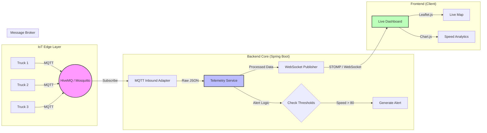

# FleetSync | Real-Time IoT Logistics Tracker 🚛 📡

**FleetSync** is an enterprise-grade, real-time logistics monitoring system. It demonstrates a high-performance **Event-Driven Architecture** capable of tracking moving assets (trucks) instantly using **MQTT** and **WebSockets**.

## 🏗️ Architecture

The system bridges the gap between low-power IoT devices (Edge) and high-speed web dashboards (User) using a reactive pipeline.



## 🚀 Features

*   **Real-Time Ingestion**: Consumes high-frequency telemetry data via **MQTT**.
*   **Live Map Visualization**: Tracks vehicle movements on an interactive map using **Leaflet.js**.
*   **Instant Updates**: Uses **WebSockets (STOMP)** to push updates to the UI with zero latency (no polling).
*   **Intelligent Alerting**: Automatically flags critical events like **Speeding**, **Overheating**, or **Low Fuel**.
*   **IoT Simulator**: Built-in simulator generates realistic traffic patterns for testing.

## 🛠️ Tech Stack

*   **Backend**: Java 17, Spring Boot 3.2
*   **Messaging**: Spring Integration MQTT, Eclipse Paho
*   **Real-Time**: Spring WebSocket (STOMP)
*   **Frontend**: Vanilla JavaScript, Leaflet.js (Maps), Chart.js (Analytics)
*   **Build Tool**: Maven

## 🏃‍♂️ How to Run

1.  **Clone the repository**:
    ```bash
    git clone https://github.com/shivamsrivastav/fleetsync-realtime-logistics.git
    cd fleetsync-realtime-logistics
    ```

2.  **Build and Run**:
    ```bash
    mvn spring-boot:run
    ```

3.  **Access the Dashboard**:
    Open your browser to `http://localhost:8080`.

## 📚 Project Structure

```
src/main/java/com/fleetsync
├── config/          # MQTT & WebSocket Configuration
├── model/           # Data Models (TruckTelemetry)
├── service/         # Business Logic (Alerts, Processing)
└── simulator/       # IoT Device Simulator
```

## 👨‍💻 Author

**Shivam Srivastav**

## 📝 License

This project is licensed under the MIT License.
