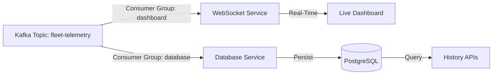

# Historical Data Analysis 📊

FleetSync now includes **PostgreSQL** integration to persist every telemetry data point for historical analysis.

## 🏗️ Architecture

We use a **Dual Consumer Pattern** to separate real-time processing from data persistence:



## 🗄️ Database Schema

### Table: `truck_telemetry`

| Column | Type | Description |
|--------|------|-------------|
| `id` | BIGSERIAL | Primary Key |
| `truck_id` | VARCHAR(50) | Truck Identifier (Indexed) |
| `latitude` | DOUBLE | GPS Latitude |
| `longitude` | DOUBLE | GPS Longitude |
| `speed` | DOUBLE | Speed in MPH |
| `engine_temp` | DOUBLE | Engine Temperature (°C) |
| `fuel_level` | DOUBLE | Fuel Level (%) |
| `timestamp` | BIGINT | Unix Timestamp (Indexed) |
| `created_at` | TIMESTAMP | Record insertion time |

## 🕰️ Historical APIs

### 1. Get Recent History
Retrieve the last 100 data points for the entire fleet.
```bash
curl "http://localhost:8080/api/history/telemetry?limit=100"
```

### 2. Truck-Specific History
Retrieve the path traveled by a specific truck.
```bash
curl "http://localhost:8080/api/history/truck/TRUCK-001"
```

### 3. Time-Range Queries
Retrieve data for a specific time window (Unix timestamps).
```bash
# Get data between two timestamps
curl "http://localhost:8080/api/history/telemetry?from=1701430000000&to=1701440000000"
```

## 🔍 SQL Analysis Examples

You can connect directly to the database to run complex analytical queries.

**Connect via Docker:**
```bash
docker exec -it postgres psql -U fleetsync -d fleetsync
```

### Average Speed per Truck
```sql
SELECT truck_id, AVG(speed) as avg_speed 
FROM truck_telemetry 
GROUP BY truck_id;
```

### Detect High Engine Temperatures
```sql
SELECT * FROM truck_telemetry 
WHERE engine_temp > 95 
ORDER BY timestamp DESC 
LIMIT 10;
```

### Distance Traveled (Approximation)
Count data points as a proxy for time active (assuming 1 msg/sec).
```sql
SELECT truck_id, COUNT(*) as active_seconds 
FROM truck_telemetry 
GROUP BY truck_id;
```

## 📈 Performance Considerations

- **Indexing**: `truck_id` and `timestamp` are indexed for fast lookups.
- **Batching**: For extremely high throughput, we could implement batch inserts (currently single insert per message).
- **Partitioning**: For production with millions of rows, table partitioning by time (e.g., monthly) is recommended.
